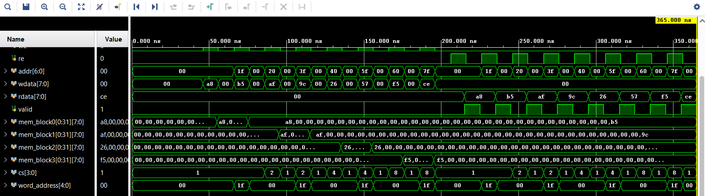
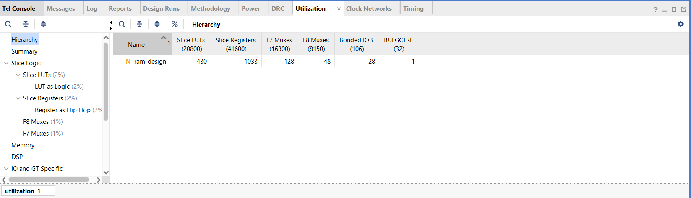
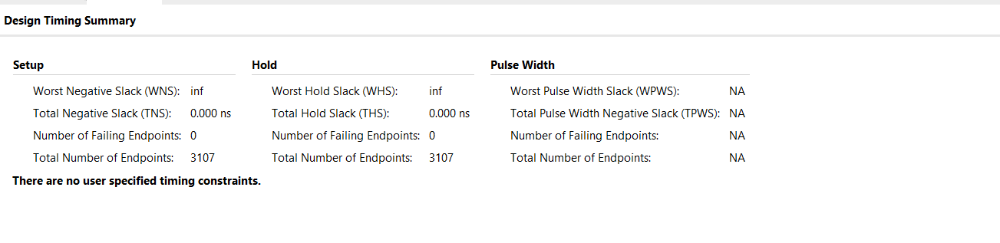
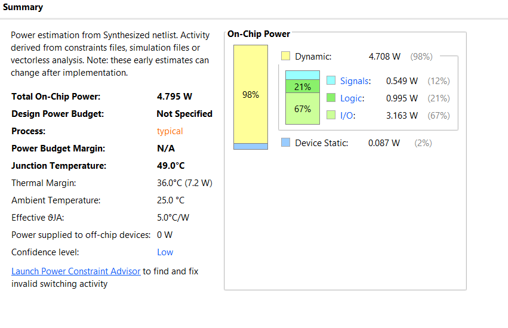

# RAM Design and Verification using SystemVerilog

A synchronous, decoder-based RAM design (4 blocks × 32 locations × 8-bit data) implemented in Verilog and verified using a class-based SystemVerilog testbench (mailboxes, virtual interfaces, clocking blocks — no UVM), built and simulated in **Xilinx Vivado**.

---

## 1. Design Overview

The RAM is organized as **4 memory blocks, each holding 32 locations of 8-bit data**, addressed by a 7-bit address:

| Address bits | Purpose |
|---|---|
| `addr[6:5]` | Selects one of the 4 memory blocks via an internal decoder (chip-select) |
| `addr[4:0]` | Selects one of the 32 locations within the selected block |

```
addr[6:0]
  ├── addr[6:5] → decoder → cs[3:0]   (one-hot chip select for 4 blocks)
  └── addr[4:0] → word_address        (location within the selected block)
```

**Ports:**

| Port | Direction | Width | Description |
|---|---|---|---|
| `clk` | input | 1 | Clock |
| `rst_n` | input | 1 | Active-low asynchronous reset |
| `we` | input | 1 | Write enable |
| `re` | input | 1 | Read enable |
| `addr` | input | 7 | Address (block select + location) |
| `wdata` | input | 8 | Write data |
| `rdata` | output | 8 | Registered read data |
| `valid` | output | 1 | High for one cycle when `rdata` holds a valid read result |

Reads and writes are both registered (synchronous), with `valid` asserted the cycle after `re` is driven high.

---

## 2. Verification Environment

The design is verified with a self-checking, class-based SystemVerilog testbench (no UVM library — built from scratch using `mailbox`, `virtual interface`, and `clocking block` constructs so it runs cleanly in Vivado's XSIM).

**Architecture:**

```
ram_generator ──► ram_wr_driver ──► DUT ◄── ram_write_monitor ──► ram_ref_model ──┐
       │                                                                          │
       └────────► ram_read_driver ──► DUT ◄── ram_read_monitor ──► ram_scoreboard ◄┘
```

| Component | File | Responsibility |
|---|---|---|
| `transaction` | `ram_pkg.sv` | Data item: op (WRITE/READ), address, write data, read data, valid |
| `ram_generator` | `ram_generator.sv` | Creates write/read transactions (directed or randomized) and queues them |
| `ram_wr_driver` | `ram_wr_driver.sv` | Drives write transactions onto the DUT via a clocking block |
| `ram_read_driver` | `ram_read_driver.sv` | Drives read transactions onto the DUT via a clocking block |
| `ram_write_monitor` | `ram_write_monitor.sv` | Passively observes writes on the bus, forwards to the reference model |
| `ram_read_monitor` | `ram_read_monitor.sv` | Passively observes reads on the bus, forwards actual results to the scoreboard |
| `ram_ref_model` | `ram_ref_model.sv` | Golden/shadow memory model — predicts expected read data |
| `ram_scoreboard` | `ram_scoreboard.sv` | Compares actual DUT output against the reference model's expected output |
| `ram_env` | `ram_env.sv` | Wires all components and mailboxes together |
| `ram_if` | `ram_if.sv` | Interface with clocking blocks/modports for driver and monitor access |
| `tb_top` | `tb_top.sv` | Top-level module: clock generation, DUT instantiation, reset, stimulus |

**Stimulus:** 8 writes followed by 8 reads, targeting two addresses in *each* of the 4 memory blocks (`0, 31, 32, 63, 64, 95, 96, 127`) — this exercises all 4 decoder chip-select lines (`cs[0]`–`cs[3]`), not just block 0.

---

## 3. Simulation Results

All 8 writes and all 8 reads passed — the scoreboard's independently computed expected values matched the DUT's actual output on every transaction, across all 4 memory blocks.

```
[GEN] sending 8 writes
[WR-MON] ... [RM] wr addr=... data=...      (x8, one per write)
[GEN] all writes done
[GEN] sending 8 reads
[RD-MON] op=READ addr=... rdata=... valid=1
[SB] PASS addr=... data=...                 (x8, one per read)
========================================
 SCOREBOARD REPORT : PASS=8  FAIL=0
========================================
TESTBENCH COMPLETE
```




---

## 4. Synthesis Results

The DUT (`ram_design.sv`) was synthesized in Vivado targeting a Xilinx Artix-7 (`xc7a35tcpg236-1`, Basys3 board).

### 4.1 Resource Utilization

| Resource | Used |
|---|---|
| Slice LUTs | 430 |
| Slice Registers | 1033 |
| F7 Muxes | 128 |
| F8 Muxes | 48 |
| Bonded IOB | 28 |



**Note on Block RAM:** No Block RAM (BRAM) primitives were inferred — the entire memory (4 × 32 × 8 = 1024 bits, plus the `rdata`/`valid` registers, totaling exactly 1033 registers) was implemented as **distributed RAM (LUTs/flip-flops)** instead. This is a direct consequence of the write-logic `always` block resetting *every* memory location synchronously/asynchronously on `rst_n` — Xilinx BRAM primitives generally do not support a full per-location reset, so the synthesis tool falls back to register-based storage. For a larger design where BRAM inference is required, the memory-array reset would need to be removed (leaving array contents undefined until the first write) to allow the tool to map the arrays onto dedicated BRAM tiles.

### 4.2 Device View


### 4.3 Timing Summary



No user-specified timing constraints (`.xdc`) were applied, so WNS/WHS report as `inf` with 0 failing endpoints — this reflects the absence of a constraint to check against, not a verified timing closure. A real timing closure result would require a constraints file with `create_clock` on `clk` (matching the 10 ns period used in simulation) followed by an implementation run.

### 4.4 Power Estimate



Total on-chip power estimate: **4.795 W** (98% dynamic, dominated by I/O at 67%). Vivado flags this as a **low-confidence, early estimate** derived without real switching activity or placement data — useful as a rough figure, not a final power number.

---

## 5. Repository Structure

```
.
├── ram_design.sv           # DUT
├── ram_if.sv                # Interface (clocking blocks + modports)
├── ram_pkg.sv                # Shared package: transaction class, op_t enum
├── ram_generator.sv
├── ram_wr_driver.sv
├── ram_read_driver.sv
├── ram_write_monitor.sv
├── ram_read_monitor.sv
├── ram_ref_model.sv
├── ram_scoreboard.sv
├── ram_env.sv
├── tb_top.sv                # Top-level testbench module
├── images/                   # Screenshots referenced in this README
│   ├── simulation_console_output.png
│   ├── utilization_report.png
│   ├── device_view.png
│   ├── timing_summary.png
│   └── power_summary.png
└── README.md
```

---

## 6. How to Run

1. Create a new RTL Project in Vivado, targeting your desired part (e.g. `xc7a35tcpg236-1` for Basys3).
2. Add `ram_design.sv` as a **Design Source**.
3. Add all remaining `.sv` files (`ram_if.sv`, `ram_pkg.sv`, `ram_generator.sv`, `ram_wr_driver.sv`, `ram_read_driver.sv`, `ram_write_monitor.sv`, `ram_read_monitor.sv`, `ram_ref_model.sv`, `ram_scoreboard.sv`, `ram_env.sv`, `tb_top.sv`) as **Simulation Sources**.
4. In the Sources panel's **Compile Order** tab, switch to **Manual** mode and ensure `ram_pkg.sv` compiles before any file that imports it, and `tb_top.sv` compiles last.
5. Set `tb_top` as the simulation top (Simulation Settings → Simulation top module name).
6. Run **Behavioral Simulation** (Flow Navigator → Simulation → Run Simulation).
7. To view synthesis results: Flow Navigator → Synthesis → Run Synthesis → Open Synthesized Design → Schematic / Report Utilization / Report Timing Summary.

---

## 7. Author

Naresh — B.Tech Electronics & Communication Engineering (IoT), IIIT Nagpur
